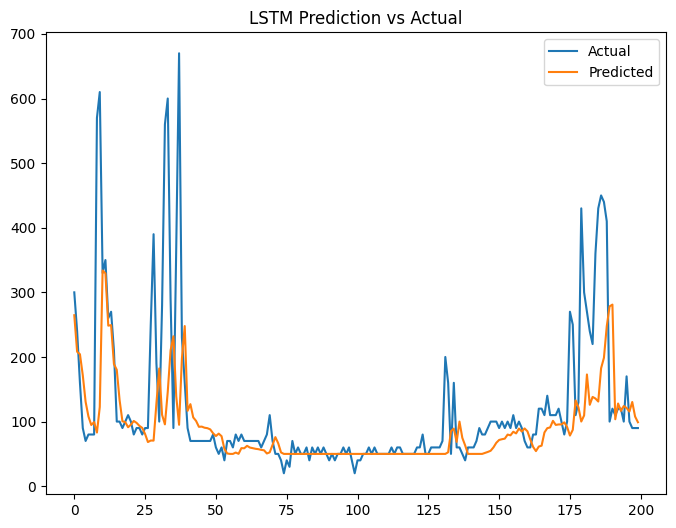

# ⚡ Energy Consumption Prediction using LSTM

This project focuses on predicting energy consumption using a **Long Short-Term Memory (LSTM)** neural network. The model is trained on time-series data to capture temporal dependencies and provide accurate future predictions.

---

## 📌 Project Overview

Energy consumption forecasting is crucial for:
- Smart grid management
- Energy optimization
- Demand planning

In this project, we use **Deep Learning (LSTM)** to model sequential patterns in energy usage data.

---

## 🧠 Model Used

- **LSTM (Long Short-Term Memory)**
  - Handles time-series data effectively
  - Captures long-term dependencies
  - Reduces vanishing gradient issues

---

## 📊 Dataset

- Dataset used: `energydata_complete.csv`
- Features include:
  - Temperature (T1–T9)
  - Humidity (RH_1–RH_9)
  - Weather conditions
  - Appliances energy consumption (Target variable)

---

## ⚙️ Tech Stack

- Python 🐍
- TensorFlow / Keras
- NumPy & Pandas
- Matplotlib / Seaborn
- Scikit-learn

---

## 🔄 Workflow

1. Data Preprocessing
   - Handle missing values
   - Normalize data
   - Feature selection

2. Train-Test Split

3. Model Building
   - LSTM layers
   - Dense output layer

4. Model Training

5. Evaluation
   - Mean Absolute Error (MAE)
   - Loss curves

---

## 📈 Results

- Model successfully learns temporal patterns
- Achieved MAE: *(add your final MAE here)*

---

## 📉 Prediction vs Actual Plot

